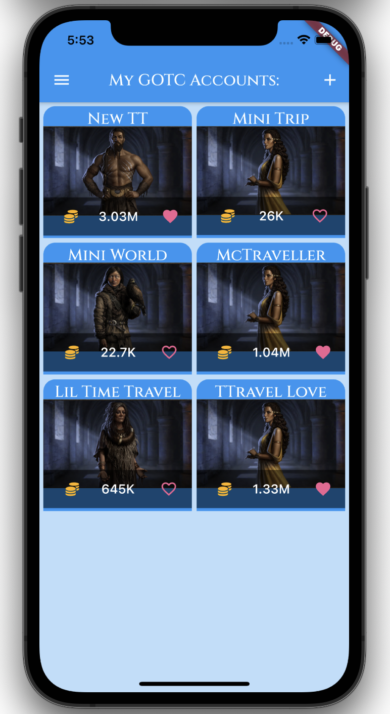
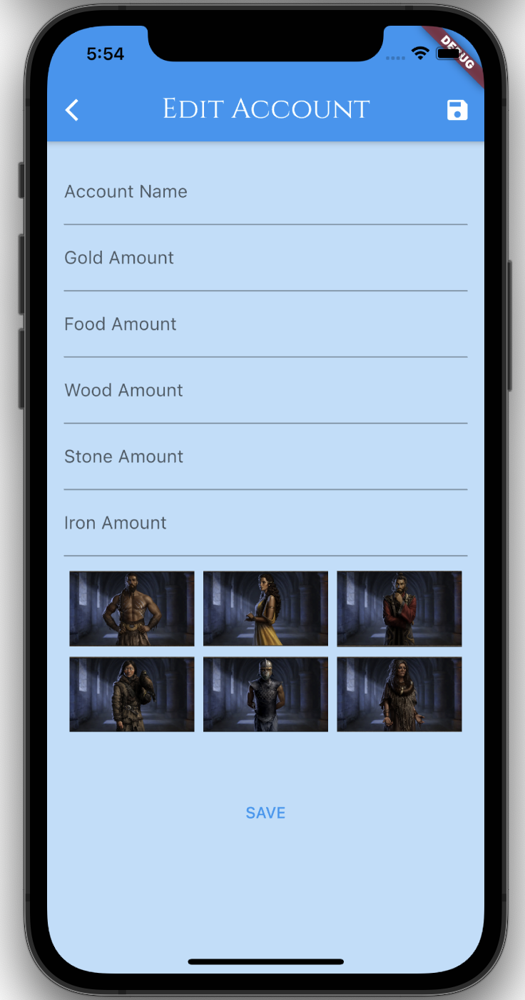
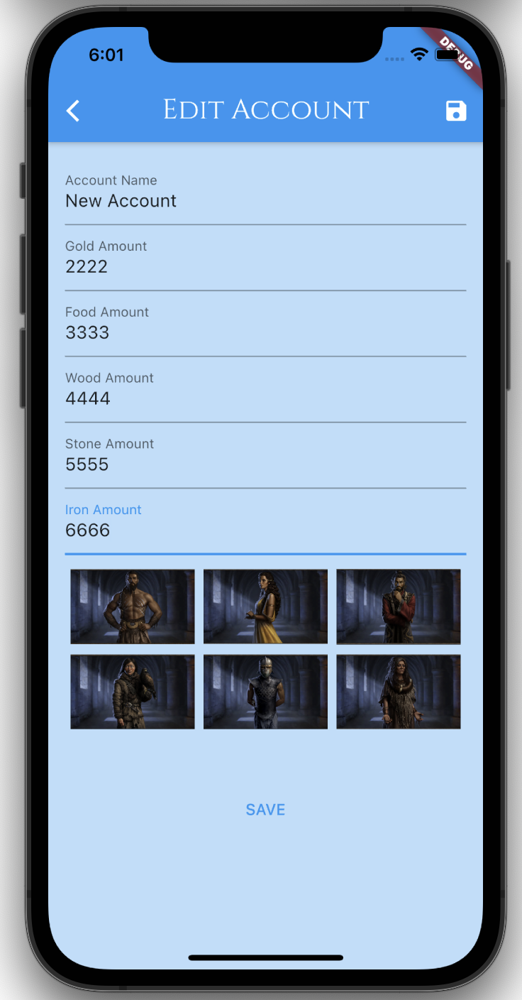
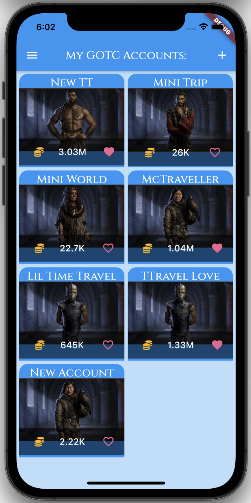
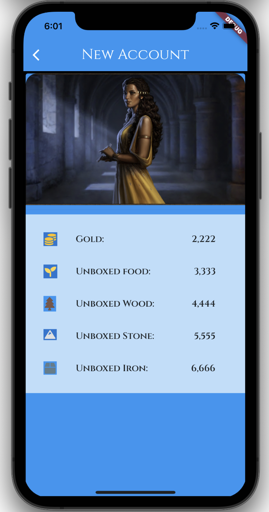
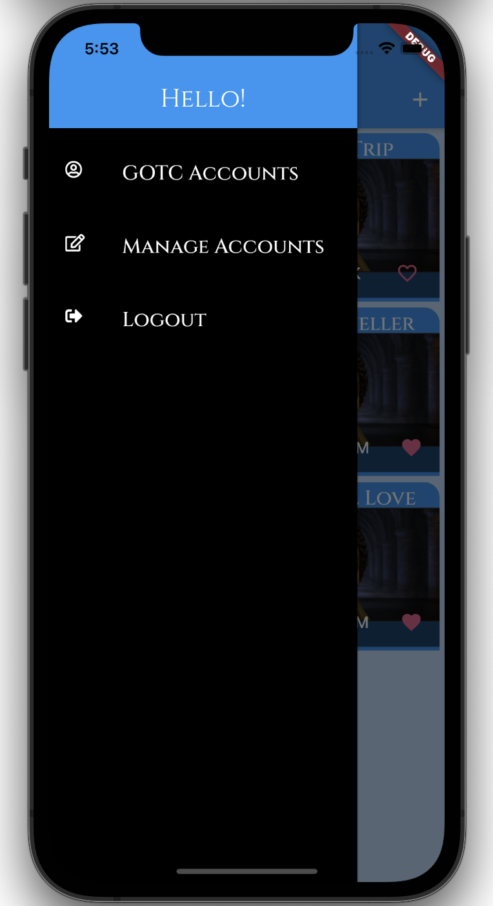
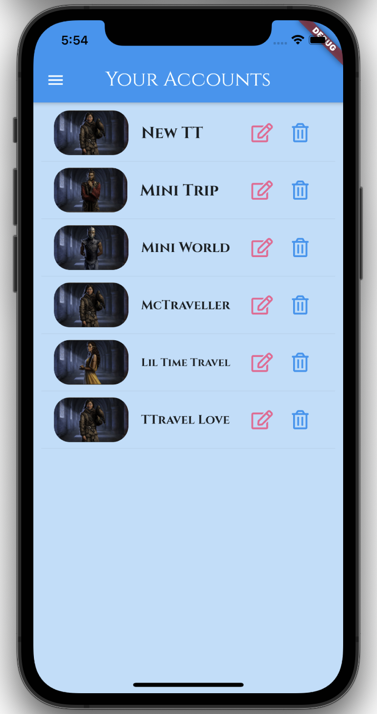

# My GOTC Accounts app v2

A personal flutter project/exercise. Simple mobile app that hold informations about owned Game Of Thrones Conquest mobile game accounts.

## Built With

- [Flutter](https://flutter.dev/) an open source framework by Google for building beautiful, natively compiled, multi-platform applications from a single codebase.
- [Firebase](https://firebase.google.com/) a Google-backed application development software that enables developers to develop iOS, Android and Web apps.

<!-- ## Getting Started
### Prerequisites
### Installation -->

## Usage

- You can add an account by clicking on the + icon. In this example there are already 6.

- When you click on the + icon this page will appear.

- You can fill in the details and save either by tapping on 'save' at the bottom or on the icon at the top right.

- The newly saved account will appear in the main page.

- If you tap on one account you can view the page with details.

- A side drawer will appear if you click on the 3 lines at the top left of the navbar.

- In the 'Manage Accounts page' you can see a list of the accounts and have the option to edit or delete.

All the details are stored on real time firebase database.

The screenshots are from the app running on iOS but it can also run on android (simulator and actual device).

Huge Thank you to Max at Udemy for the amazing Flutter course. 